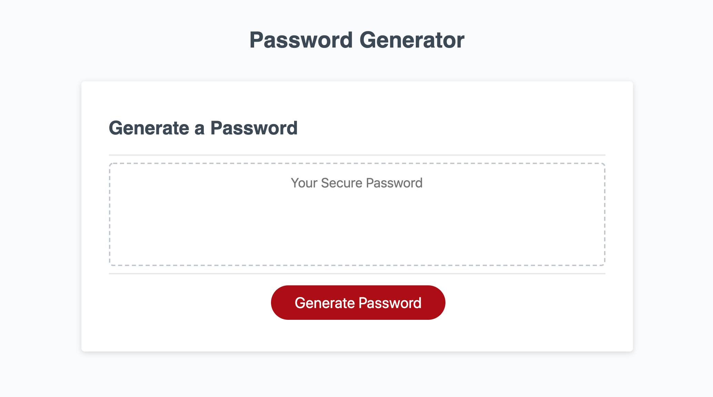

#  **Password Generator** #
[GitHub](https://github.com/charrmountain/password-generator)
[Deployed Link](https://charrmountain.github.io/password-generator/)

## **Description**

-  Create your very own password by selecting "Generate Password". Firstly, the user may pick any length between 8-128 characters. Secondly, the user picks their choice of uppercase, lowercase, numeric, and/or special characters. Lastly, they will receive (at random for security) a new password containing the parameters they selected. Unless, user picks length **not** in parameters * *OR* * they will be notified "Unacceptable Password".

    - ### **HTML pages:**

         1. [index.html](index.html) is the main password generator page
         2. [script.js](portfolio.html) is the JavaScript for script to make generator run correctly.

    - ### **Style Sheets** (used on all HTML pages)**:**

         3. [style.css](style.css) (created by Coding-Bootcamp)

## **Visuals**

- When user clicks generate password they will be prompted with a series of questions.
    - How long would you like the password?
    - Do you want lowercase characters?
    - Do you want uppercase characters?
    - Do you want numeric characters?
    - Do you want special characters?
- Users will notice where the "Your Secure Password" will now display their new password with their chosen length and characters

## **Usage**

- Generates a safe and customizable password for user.

## **Support**
    

- e-mail: charr.mt@gmail.com